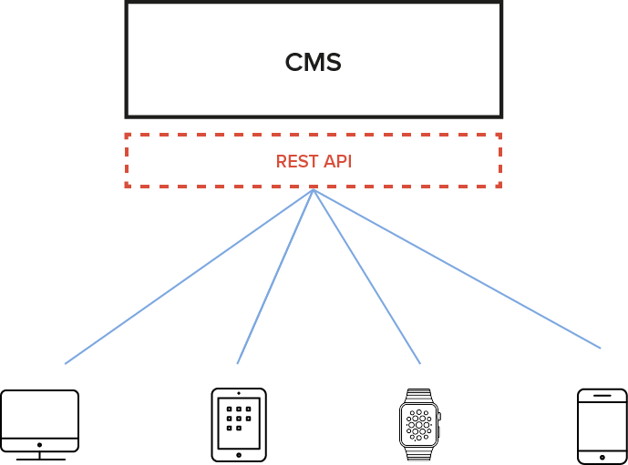

# The Headless CMS

We look at the difference between a traditional and a headless CMS, how a headless CMS slots into web development, and discuss some of the advantages of using a headless CMS for your web project.

A headless CMS is used only for data capture, storage, and delivery, making it frontend agnostic. Its data can be displayed using any frontend technology, whether in a browser, mobile application, syndication, or elsewhere.

A traditional CMS deals with data collection, delivery, and display. WordPress, for example, has a backend where users can enter data. This data is stored in a MySQL database, retrieved from the database using PHP, and then displayed in the browser using the theme system.

A headless CMS decouples the theme system, allowing you to replace it with
the frontend technologies of your choice. What’s left is the data storage method and web application for authors and editors, while the data is delivered to the frontend using an API.

## Decoupling content management from frontend display

By decoupling content management from frontend display, a headless CMS allows developers to use any technology to display content. Developers are not locked into the templating engine provided by the CMS. The CMS might be written in PHP, but developers working in languages like JavaScript, Java, Ruby, and Swift can use an API to retrieve, store and display data. A frontend developer has complete control over the website or application’s markup and user experience, using client-side technologies to create smooth interactive experiences. It also means that if the frontend needs to be displayed in a new way (for example a redesign or to display content on a new device) the CMS can still store the data, removing the need for complex migrations.

## Fast, interactive experiences

When you use a headless CMS there are two components: the CMS itself and the frontend display. The CMS focuses only on content management, without having to assemble formatted responses, while the client-side technology can quickly display that data in the browser. Using client-side technologies for display means that in-browser experiences are fast, acting in real-time, without having to wait for PHP queries to retrieve information from the database. There is a significant increase in performance when using JavaScript vs PHP: Node.js, for example, [can handle many more requests than PHP due to its asynchronous event-driven nature](http://www.hostingadvice.com/blog/comparing-node-js-vs-php-performance/). This can be especially useful when an application requires many connections open simultaneously.

## One content management system, multiple frontends

With a traditional, monolithic CMS, data is simply displayed by the CMS itself. Data stored in a headless CMS is available for display in any context. You may want to use it for a website now, but later you may decide to use the same data for a desktop or touch screen application. The stored data is always available via the API.

## Multi-service content pipelines

A headless CMS can be used to store all of the data for one site or application, or it can just be one element of a larger application that retrieves and aggregates data. This means that data can be integrated into existing workflows as just one layer. For example, it could be used just as a layer for translating content which is then pushed to another CMS.
