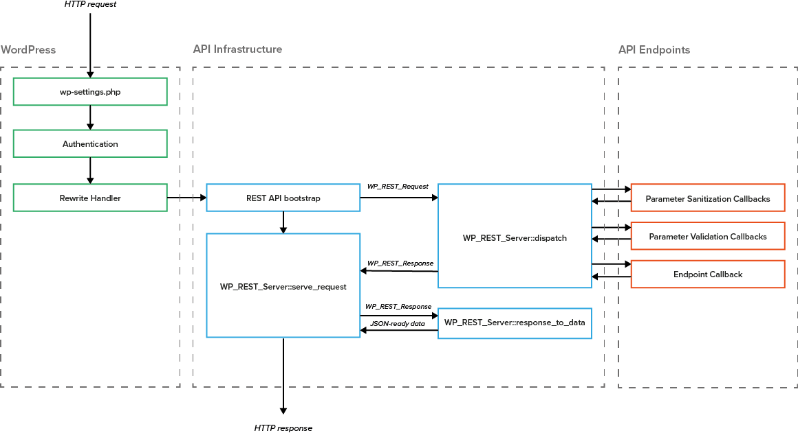

# What is the WordPress REST API?

*We look at the specifics of the WordPress REST API, including its infrastructure and endpoints, its authentication methods and the concept of hypermedia. We also introduce you to the team behind it.*

The WordPress REST API allows access to a website’s data, including users, posts, and taxonomies. In the past, developers needed to use WordPress’ built-in theme system and administration panel to display and edit content on
a site.

The REST API decouples the WordPress backend from the frontend, allowing developers to use it as an application platform: WordPress is used for data entry and storage, and the frontend can be built in any programming language. The REST API transforms WordPress into a headless CMS.

## Infrastructure
WordPress 4.4 contains the infrastructure for the WordPress REST API. This can be thought of as a construction kit for RESTful APIs in WordPress: it enables developers to build their own REST APIs, handling things like API discovery, request routing, arguments, JSON serialisation/ deserialisation, and response codes. If you are building a website, application, theme or plugin, you can use the API by adding your own [custom endpoints](http://v2.wp-api.org/extending/adding/).

The REST API decouples the WordPress backend from the frontend, transforming it into a headless CMS.

## Endpoints
Endpoints are functions that are available through the API: they’re the places where developers can do something with the CMS, whether that’s creating, retrieving, updating or deleting (CRUD) data. This includes the four core data types in WordPress (posts, comments, terms, and users) initially, although these will grow in future versions of WordPress to support all data on the site.

## Authentication
A major challenge around building a REST API is authentication: how does an API know that a user should be allowed to update content on a site, for example? Who should be allowed to retrieve data? Under what conditions?

The WordPress REST API uses two forms of authentication:
- **Cookie** - this is the basic authentication method used in WordPress. When you log into your dashboard a cookie is set in your browser. This method is only viable when the current user is logged into WordPress and that user has the capability to perform the action requested.
- **OAuth** - this is the main authentication method used for external clients, i.e. any third-party site or application that wants to interact with the API. With OAuth, logged in users can authorise clients to act on their behalf. Clients are issued with OAuth tokens so they can interact with the API. The REST API uses OAuth 1.0a so that it can be used by all WordPress websites; OAuth 2.0 requires HTTPS but WordPress does not.

In addition, there is a Basic Authentication method for external clients. However, this is only recommended for development environments as it involves passing your username and password on every request, and giving your credentials to clients.

## The Team

The WordPress REST API has contributions from 72 developers. However, the team has had four core members:
- Ryan McCue (Human Made) Co-Lead of the REST API
- Rachel Baker (Wirecutter) Co-Lead of the REST API
- Joe Hoyle (Human Made)
- Daniel Bachhuber (Hand Built)
