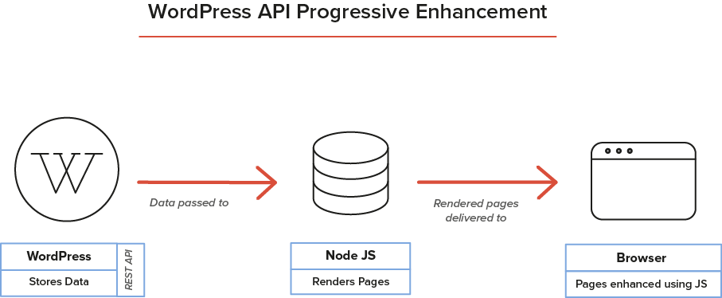

# Challenges presented by the REST API

*We explore the challenges that will be brought about by the REST API and discuss some of the ways that these challenges will be addressed both in individual projects and by the wider WordPress community.*

The introduction of the REST API marks a new era in WordPress development. Not all the ways that the REST API will change WordPress are clear, but some challenges are already emerging.

## Loss of core functionality
A REST API driven website loses frontend features that are linked to the WordPress theme system, like menu management and post previews. Frontend developers need to take responsibility for re-implementing features that come for free with WordPress. If they are not rebuilt, users must do without them. When writing project specifications for an API-driven project, it will become necessary to be very specific about the features that the client needs and not just assume that because they are in WordPress they are available.

To solve this problem, we anticipate the emergence of REST API base themes that rebuild WordPress features on the frontend. These boilerplate themes will be written in different languages and will provide a starting point for frontend developers to build on.

## Disempowers WordPress site builders
In addition to its ease of use, WordPress’ strength is that it is easy to set up a website. Through WordPress, many people gain experience of PHP, CSS, and HTML, gaining confidence to make changes to the frontend of their website. The REST API completely decouples the frontend from the backend, disempowering those users, and making the frontend only editable by developers.

For this reason, it is unlikely that we will see a major disruption to the WordPress theme market. Instead, the REST API will be of most significance to large custom builds and WordPress-based SaaS products.

## The necessity for structured, portable data
A headless WordPress requires data that can be used across multiple contexts. This means creating and storing it in a way that is completely frontend agnostic. In the first instance, you may just be using data on
a website, but you may want to make it available later to a native application. The focus here is on content management as opposed to web publishing. This data needs to be structured in a modular manner, separate to the CSS and HTML. For this reason, REST API- driven sites will not rely on the WYSIWYG capability in TinyMCE for page layouts, instead using content structured by [modular page builders](https://github.com/humanmade/modular-page-builder).

WordPress’ commitment to backwards (and forwards) compatibility ensures that data produced by the API will continue to be readable and usable well into the future. This means that you can safely store it knowing that it will continue to be available through a well-supported API. In addition, the WordPress REST API is open, ensuring that your data can be moved out of your site using standard tools.

## Dealing with progressive enhancement


In an increasingly JavaScript-driven world, progressive enhancement is a challenge that has to be addressed. Some people have JavaScript disabled in their browser, either because they use assistance technologies, because of personal preference, or because the organisation they work for requires it to be turned off. If content from a REST API driven WordPress website is delivered to a JS- powered frontend, these people will simply see a blank page.

Developers need to address these issues to ensure that the web stays accessible. One method is to render frontend templates on the server using a technology like Node. js, and then enhance the website on the frontend using client- side JavaScript. This setup, however, requires an additional server, and developers with the experience to implement it.
