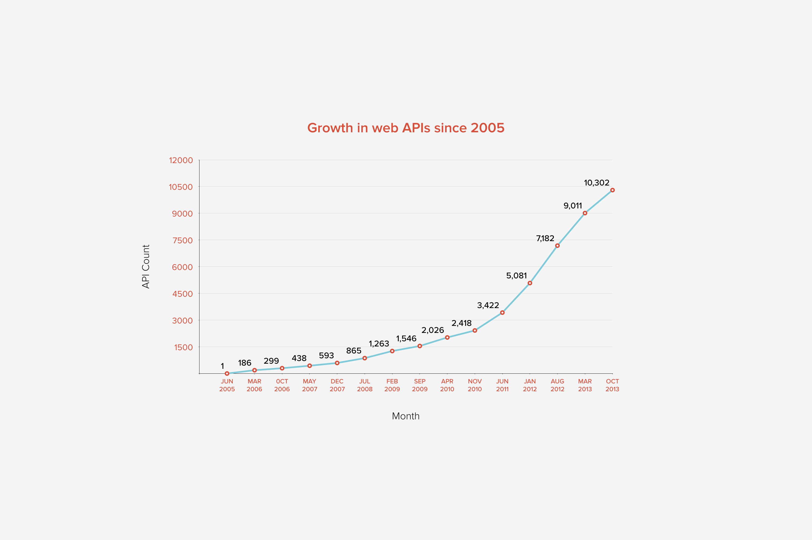

# What is a REST API?
We look at what the REST architectural style is, explore the elements that make an API RESTful, and consider some of the ways in which open APIs are changing the internet.

## What is REST?
**Representational State Transfer (REST)** is a software architectural style for Application Programming Interfaces (APIs) that consists of guidelines and best practices for creating scalable web services. REST uses simple HTTP to make calls between machines.

This happens via a request/response mechanism between the server and the client. For example, a client, let’s say an Android application, makes a request for the most recent posts from the website. The server knows how to interpret this request, through REST, and satisfies the response by providing the most recent posts in a format understood by the client.

REST requests interact with the resources in your application (e.g. a Post or Page). These interactions are typically Reading, Creating, Updating, or Deleting. Combined with HTTP, REST requests are formed using four verbs:

- ```POST```: Create a resource
- ```GET```: Retrieve a resource
- ```PUT```: Update a resource
- ```DELETE```: Delete a resource

The data retrieved is supplied in a machine-readable format, often JSON in modern web applications.
> REST was proposed by Roy Fielding in his 2000 dissertation [Architectural Styles and the Design of Network- based Software Architectures](http://www.ics.uci.edu/~fielding/pubs/dissertation/abstract.htm).

## What makes an API RESTful?

An API must have the following architectural features to be considered RESTful:
- **Client-server**: the client is separated from the server. This means that clients are not concerned with data storage and servers are not concerned with display. This ensures that data is portable and can be reused in multiple clients, and servers are simpler and more scalable.
- **Cacheable**: clients can, and should, cache responses to improve performance, and avoid the server with every request.
- **Stateless**: the necessary state to handle the request is contained in the request itself, whether as part of the query parameters, URL, body, or headers.
- **Uniform interface**: information transferred via REST comes in a standardised form, creating a simplified, decoupled architecture.
- **Layered System**: the architecture is composed of hierarchical layers. Each component cannot “see” beyond its layer: a client cannot tell if it’s connected to the server or to an intermediary.

A separate, but closely-related concept is hypermedia. Hypermedia allows a client to more fully discover a REST API without needing to know anything about the structure of the API. It’s similar to hyperlinks on the human-readable web (which enable discovering new sites and content). The server provides the information the client needs to interact with it. This means that the client can interact with the server in complex ways without knowing anything beforehand about it.

## What is an open API?


*Source: Programmable Web*

Open APIs are publicly available APIs that give developers access to proprietary software information that they can make use of in their own software and applications. REST is the ideal architecture for creating an Open API for the web because, by using HTTP, it is built on the principles of the open web. To leverage an open REST API a developer just needs to make a HTTP request.

By making data available for developers to use in their own applications, open APIs are transforming the internet. Developers can access data across services, creating applications that aggregate information from different providers. The impact of APIs cannot be overestimated; they are transforming the way businesses and services are run. For example:

- [Around 25% of annual revenue of the fundraising platform JustGiving is API-driven](http://www.3scale.net/2014/08/justgiving-api-grows-giving-non-profits-profits-alike/)
- In 2011, [Twitter reported that they had more than one million applications registered, with a number of entire companies built off the API](http://blog.twitter.com/2011/one-million-registered-twitter-apps)
- [Data feeds from the Skyscanner API are used by startups like Hitlist, Go Euro, and Pintrips](http://www.programmableweb.com/news/why-skyscanner-api-appeals-to-travel-startups/elsewhere-web/2015/11/21)
- [Hilton is making use of Uber’s API to allow guests to book rides from the Hilton Honors App](http://techcrunch.com/2015/09/01/checking-out-hiltons-app-now-lets-you-get-an-uber/)

This aggregation of public data across different platforms enables the creation of feature-rich, powerful applications that do more than any individual product or service could do on its own.
