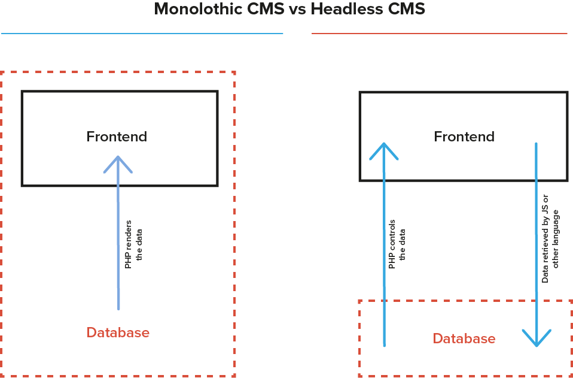
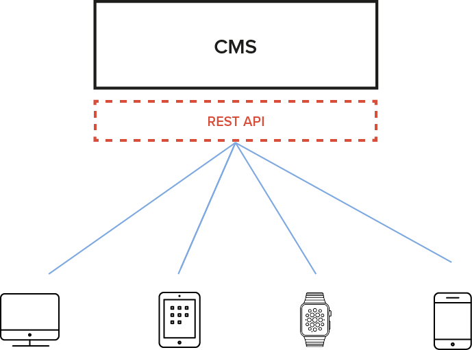
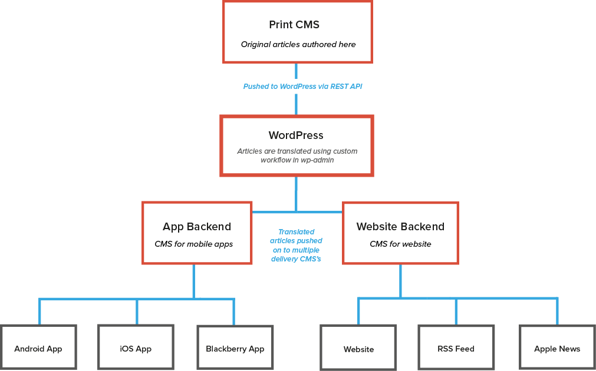

# ヘッドレスCMS

*一般的なCMSとヘッドレスCMSとの違いを見てみましょう。ヘッドレスCMSはどのようにウェブ開発に導入されるのでしょうか。また、あなたのプロジェクトでヘッドレスCMSを活用するメリットについても考えていきましょう。*

ヘッドレスCMSはデータの取得、保存、提供にのみ使用され、フロントエンドへの表示には関与しません。そのデータは多くの場合APIを経由して提供され、どのようなフロントエンドテクノロジーでも利用することができ、ブラウザやアプリケーション、その他のシステムなどに依存しません。

一方で、一般的なCMSは、データの管理や提供に加えて、表示も行ないます。例えばWordPressの場合、ユーザーがデータを送信できるバックエンドがあります。このデータはPHPを経由してMySQLに保存され、その結果がブラウザで表示されます。

ヘッドレスCMSはテーマシステムを分離し、あなたの好きなフロントエンドテクノロジーに置き換えることを可能にします。データがAPI経由でフロントエンドに提供されているので、バックエンドの仕組みを意識する必要はありません。

## フロントエンドとコンテンツ管理の分離

フロントエンドとコンテンツ管理を分離することで、ヘッドレスCMSは開発者に、自分の好きなフロントエンドテクノロジーを選択することを可能にします。開発者はCMSによって提供されるテンプレートシステムからの束縛から解放されるのです。CMSがPHPによって記述されている場合でも、他の言語、例えばJavaScriptやJavaやRuby、Swiftなどを使ってデータを保存したり表示することができます。フロントエンドディベロッパーは、マークアップやユーザーエクスペリエンスに集中することができ、クライアントサイドテクノロジーを使って、よりスムーズでインタラクティブなユーザーエクスペリエンスを創造することができます。さらにこのことが意味するのは、もしフロントエンドを新しい方法（例えば新しいデバイスのためにデザインをし直すなど）で表示する必要が出てきた場合に、CMSがデータを保存しているのでマイグレーションを行う必要がありません。

## 高速な体感速度

ヘッドレスCMSを使う場合、そこには二つのコンポーネントがあります。一つはCMS本体、そしてフロントエンド。CMSはコンテンツ管理のみに集中することができ、フロントエンドで表示するためにレスポンスのフォーマットを気にする必要はありません。ブラウザによるクライアントサイドテクノロジーを使った非同期処理は高速で、リアルタイム、そしてPHPがデータベースからデータを取得するのを待つ必要がありません。PHPに代わって、例えばJavaScript(Node.js)を使用すれば、[Node.jsの非同期処理によってより多くのリクエストを処理することができます。](http://www.hostingadvice.com/blog/comparing-node-js-vs-php-performance/)。これはアプリケーションが多くの同時接続を必要とする際にとても有効です。

## 一つのコンテンツ管理システム、複数のフロントエンド

従来のモノリスなCMSではデータは単純にCMS自身によって表示されます。ヘッドレスCMSで保存されたデータはどんな場面でも表示されます。あなたが今それらのデータをウェブサイトとして使用したいとしても、後日同じデータをタッチパネルのアプリケーションでも表示したいと思うかもしれません。保存されたデータは常にAPI経由で提供されますので、複数のフロントエンドで表示することも可能です。

## 複数サービスのコンテンツパイプライン

ヘッドレスCMSは、一つのウェブサイトやアプリケーションのためにすべてのデータを保存するために使用できますが、さらに巨大なアプリケーションの一つの要素を収集したり提供したりするためのものとしても利用できます。このことは既存のワークフローの一部のレイヤーとしてデータを利用することを可能にすることを意味しています。例えば、コンテンツの翻訳のみをWordPressで行い、その結果を他のCMSにプッシュするなどの利用方法が考えられます。
