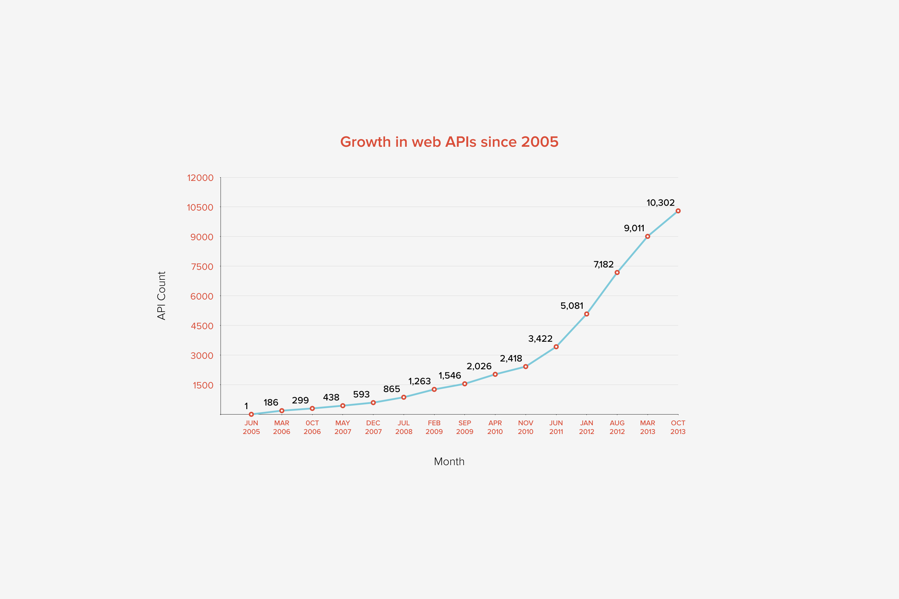

# REST APIとは？

*REST APIがどのように設計されているか、Restful APIによって生成される要素について、そしてオープンなAPIがインターネットをどうのように変えるかを考えていきましょう。*

## RESTとは？

**Representational State Transfer (REST)**とはApplication Programming Interfaces (APIs)のためのソフトウエアの設計スタイルのひとつで、スケーラブルなウェブサービスを開発するためのベストプラクティスのひとつです。RESTは、単純なHTTPを用いてマシン間の通信を可能にします。

これはサーバー間のリクエスト/レスポンス時に実行され、例えばAndroidアプリケーションから「もっとも最新の投稿」をリクエストする等に利用されます。サーバーはRESTを通してこれを解釈し、クライアントが解釈しやすいフォーマットで「もっとも最新の投稿」の要求に応えます。

RESTリクエストは、多くの場合、あなたのアプリケーションのリソース（例えば投稿や固定ページ）に対して、新規作成、取得、更新、削除を提供しています。

- ```POST```: リソースの新規作成
- ```GET```: リソースの取得
- ```PUT```: リソースの更新
- ```DELETE```: リソースの削除

RESTによるデータは、機械によって読みやすいフォーマットで提供され、最近のモダンなウェブアプリケーションではJSONがしばしば使用されます。
> RESTは、Roy Fielding氏による2000年に発表された論文で提案された。 [Architectural Styles and the Design of Network- based Software Architectures](http://www.ics.uci.edu/~fielding/pubs/dissertation/abstract.htm).

## APIをRESTfulとするための条件は？

APIがRESTfulであるには以下の要件を満たしている必要があります。
- **クライアント - サーバー**: クライアントはサーバーから分離されている必要があります。このことは、クライアントはデータの保存に関与してはいけませんし、サーバーはデータの表示に関与してはいけないことを意味しています。これにより、データがポータブルで複数のクライアントから利用可能となり、サーバーがよりシンプルでスケーラブルになります。
- **キャッシュ可能**: クライアントはキャッシュが可能であり、パフォーマンスを改善するためにキャッシュをし、すべてのリクエストのたびにサーバーにリクエストを行うことを避けるべきです。
- **ステートレス**: クエリーやURL、ヘッダーなどのHTTPリクエストの中に、そのリクエストを理解するためのすべての情報が含まれている必要があります。（訳注：例えばPHPのセッション機能などを使用して、同じリクエストに対して違う戻り値が帰ってくることがあり得るようなAPIはRESTful APIとは言えません。）
- **汎用的な構文**: RESTによって提供されるデータは、汎用的で機械判読しやすいフォーマットであり、特定の製品の仕様等に依存してはいけません。
- **レイヤリング**: キャッシュやプロキシなどの様々なレイヤーでリクエストを処理することができる必要があります。そしてクライアントは自分がどのレイヤーなのかを意識する必要がないように設計されるべきです。

それぞれが独立し、かつ結合しあうことはハイパーメディアのコンセプトです。APIの詳細な仕様を知らなくても、クライアントはREST APIの仕様によってどこに何があるかを完全に理解することができます。それは人間にとって読みやすいハイパーリンクに似ています。（ハイパーリンクは新しいサイトやコンテンツの発見を容易にしてくれます。）サーバーは、REST APIの仕様に基づいて、クライアントが必要な情報を提供します。これはクライアントが事前の接続なしに様々な方法でアクセスできることを意味しています。

## オープンなAPIとは？


*ソース: Programmable Web*

オープンなAPIとは、開発者が彼らのソフトウエアやアプリケーションから、プロプライエタリな情報にアクセスし使用するために一般に公開されているAPIのことです。RESTは、ウェブのオープンさの上に構築されたHTTPを使用していることにより、オープンなAPIを作るための理想的な設計方法です。オープンなREST APIを使用するに開発者に唯一必要なことはHTTPリクエストを送ることです。

By making data available for developers to use in their own applications, open APIs are transforming the internet. Developers can access data across services, creating applications that aggregate information from different providers. The impact of APIs cannot be overestimated; they are transforming the way businesses and services are run. For example:

オープンなAPIは、開発者に対して彼らのアプリケーションでデータを使用できるようにすることにより、インターネットに変化をもたらします。開発者は異なるサービス間をまたがってデータにアクセスできるようになり、異なるプロバイダーからデータを収集するアプリケーションを作ることが可能です。APIがもたらすインパクトは過小評価できません。それらは

- [Around 25% of annual revenue of the fundraising platform JustGiving is API-driven](http://www.3scale.net/2014/08/justgiving-api-grows-giving-non-profits-profits-alike/)
- In 2011, [Twitter reported that they had more than one million applications registered, with a number of entire companies built off the API](http://blog.twitter.com/2011/one-million-registered-twitter-apps)
- [Data feeds from the Skyscanner API are used by startups like Hitlist, Go Euro, and Pintrips](http://www.programmableweb.com/news/why-skyscanner-api-appeals-to-travel-startups/elsewhere-web/2015/11/21)
- [Hilton is making use of Uber’s API to allow guests to book rides from the Hilton Honors App](http://techcrunch.com/2015/09/01/checking-out-hiltons-app-now-lets-you-get-an-uber/)

This aggregation of public data across different platforms enables the creation of feature-rich, powerful applications that do more than any individual product or service could do on its own.
