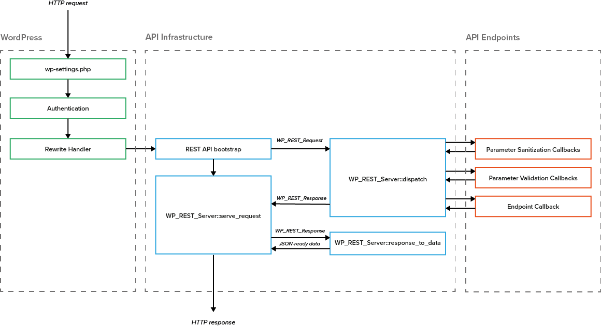

# WordPress REST API とは何か

*WordPress REST APIの詳細を見ていきましょう。この章では、APIのインフラ、エンドポイント、認証方法、そして「ハイパーメディア」のコンセプトについてご説明しながら、開発チームもご紹介します。

WordPress REST APIを利用すると、ユーザー、投稿、タクソノミなどのウェブサイトのデータへのアクセスが可能になります。これまでは、サイトのコンテンツを表示したり編集したりしたいとき、開発者はWordPressのテーマを作ったり管理画面にログインしなければなりませんでした。

REST APIは、 WordPressのバックエンドをフロントエンドから切り離します。その結果、開発者はWordPressをアプリケーションプラットフォームとして使うことができるようになります。WordPressはデータの入力とストレージのために使われ、フロントエンドは好きなプログラミング言語を使って作成することができるようになったのです。

## インフラストラクチャー

WordPress 4.4はWordPress REST APIのインフラを搭載しています。このインフラとは、開発者が独自のRESTful APIを構築する際のスターターキットとして考えることができます。つまり、API探索、リクエストのルーティング、JSONのシリアライズやデシリアライズ、レスポンスコードなどを扱うためのベースということです。ウェブサイトやアプリケーション、テーマやプラグインを作成する際、このベースの上に独自の[カスタムエンドポイントを作成](http://ja.wp-api.org/extending/adding/)して、 APIの利用を始めることができます。

バックエンドがフロントエンドから切り離され、WordPressはヘッドレスCMSになるのです。

## エンドポイント

エンドポイントとは、APIを通じて利用可能な機能のことです。開発者がWordPressのデータを作成、取得、更新、削除（CRUD）するための場所です。現在は、WordPressの中心的なデータタイプである投稿、コメント、ターム、ユーザーの4種が対象に含まれており、将来のバージョンでは、サイトのすべてのデータのためのエンドポイントが導入されます。

## 認証

REST APIを構築するにあたって大きな挑戦となるのが認証です。たとえば、あるユーザーに、サイトのコンテンツ更新を許可するか否か、APIはどのように判断するべきなのでしょうか。データの取得を許されているのはどのユーザーなのか、その判断方法や条件について見ていきましょう。

WordPress REST APIでは、2つの認証方法を利用できます。

- **クッキー** - すでにWordPressで利用されている認証方法の転用です。ユーザーがWordPressの管理画面にログインするときに、ブラウザにセットされるクッキーを利用してAPIにアクセスします。この方法は、ユーザーがブラウザを利用してWordPressサイトにログインしており、かつ、そのログインユーザーが権限を持っている時にのみ、APIを通じたアクションが可能になります。
- **OAuth** - OAuth認証は、サードパーティのサイトやアプリケーションなどの外部クライアントがAPIと通信する際に利用する認証方法です。OAuth認証では、WordPressサイトにログインしているユーザーが、外部クライアントを認証し、ユーザー自身に代わってアクションをすることを許可します。クライアントには、OAuthトークンが発行され、クライアントはこのトークンを利用してAPIと通信します。WordPress REST APIは、OAuth 1.0a を利用しており、すべてのWordPressサイトが OAuth 認証を利用できます。（OAuth 2.0 にしてしまうと、HTTPS通信が必須になり、HTTP を許容するWordPressにはそぐわないためです。）

外部クライアントが利用できる方法にはベーシック認証もあります。ですが、リクエストを行なうたびに
ユーザー名とパスワードをクライアントに送信しなければならないため、ベーシック認証は開発環境のみで利用することを推奨しています。

## 開発チーム
WordPress REST API には72名のコントリビューターがいます。なかでもコアな貢献者は以下の4名です。

- Ryan McCue (Human Made) Co-Lead of the REST API
- Rachel Baker (Wirecutter) Co-Lead of the REST API
- Joe Hoyle (Human Made)
- Daniel Bachhuber (Hand Built)
