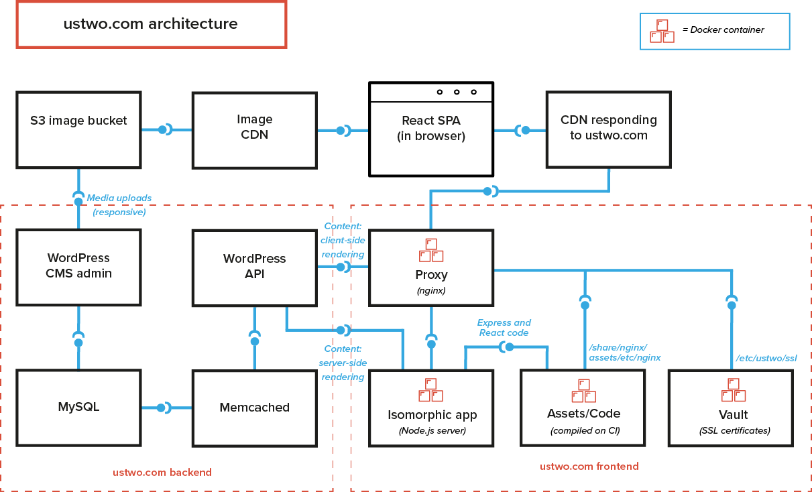

# 事例: ustwo

*[ustwo](http://ustwo.com)は、Reactを使ってウェブサイトをWordPressのバックエンドとフロントエンドに分離。*

私たちは、オープンソースCMSであるWordPressに対するサポートや貢献を今後も継続していきたいと強く思っており、そのためにWordPressを選択しました。デザインはとても重視しており、これを満足させるためにシングルページアプリケーションを選択しましたが、これはWP-APIによって可能になりました。
Daniel Demmel, ustwo

出展: ustwo

## 仕組み

ustwoのウェブサイトはシングルページアプリケーションです。フロントエンドはReactを使用して構築されており、コンテンツの管理にWordPressが使用されています。Reactが使用されたのは、それがisomorphic rendering（ページがサーバーでもクライアントでもレンダリングできる）を可能としているからです。Node.jsによるサーバーがあり、これがサーバーサイドによるレンダリングを可能にしているのです。

WordPress側では、[カスタムページビルダー](https://github.com/mattheu/modular-page-builder)を使用してコンテンツをモジュール風に投稿できるようにしています。このことでコンテンツを目的に応じてポータブルに使用できるようにしています。REST APIによるインフラは、JSONフォーマットでフロントエンドにコンテンツを提供するためのカスタムエンドポイントとしても使用されています。
