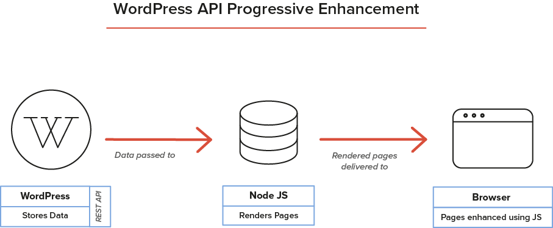

# REST APIが提供する挑戦

*REST APIによって光を浴びるであろう挑戦や、これらの挑戦が個々のプロジェクトやWordPressコミュニティで活用される方法を考えていきましょう。*

REST APIの登場は、WordPressの開発の歴史において新たな時代の幕開けとなりました。REST APIがどのようにWordPressを変えていくかはまだクリアではありませんが、いくつかの挑戦が登場し始めています。

## WordPress本体の機能の喪失

メニューの管理や投稿のプレビューなど、REST API駆動のウェブサイトでは、WordPressのテーマシステムに基づいた幾つかの機能がありません。フロントエンドディベロッパーは、WordPressにあったいくつかのフロントエンドの機能を再構築する必要があります。もしそれがなければユーザーがそれをしなければなりません。API駆動のプロジェクトのための仕様を考える際には、WordPressの機能やクライアントのニーズを満たすものである必要があります。

この問題を解決するために、私たちはWordPressの機能をフロントエンドで再現するためのRET APIベースのテーマシステムが現れるであろうことを予測しています。これらの汎用的なテーマは異なる言語で記述され、フロントエンドエンジニアが何かを開発するための起点となるでしょう。

## WordPressサイト制作者の負担を減らす

WordPressは、その使いやすさ以外にもセットアップが容易であるという強みがあります。WordPressを通して多くの人々がPHPやCSS、HTMLのスキルを習得し、それによって彼らのウェブサイトのフロントエンドが改善されています。REST APIはフロントエンドとバックエンドを完全に分離するので、ユーザーの負担を減らし、フロントエンドを開発者のみが編集可能となります。

このことでWordPressのテーママーケットに大きな混乱を引き起こすとは思っていません。代わりにカスタムビルドのWordPressをベースにしたREST APIのSaaSサービスが出現することを期待しています。

## 構造化されたポータブルデータの必要性

ヘッドレスなWordPressでは、データが複数の目的で使用できる必要があります。このことはフロントエンドは、データがどのように作られてどのように保存されるかについて知る必要がないことを意味しています。例えば、あなたがデータをウェブサイトで使っており、しかしその後ネイティブアプリケーションからも使いたいと考えたとします。このとき重要なのはコンテンツ管理がウェブサイトとは違うことです。この際のデータはモジュール風に分けられ、HTMLとCSSも分割されている必要があります。その理由はAPI駆動のウェブサイトはTinyMCEによるWYSIWYGエディターのページレイアウトでは対応できないケースがあるためです。このようなケースでは、[modular page builders](https://github.com/humanmade/modular-page-builder)を使用することをおすすめします。

WordPressが保証する後方互換性は、APIによるデータが将来においても利用可能であることを保証しています。このことによってデータを安心して保存できる信頼性の高いAPIであると言えます。さらに、WordPressのREST APIはオープンであり、標準的なツールでデータを使用することができます。

## プログレッシブエンハンスメントへの対応

JavaScriptの世界では、プログレッシブエンハンスメントは取り組むべき重要な課題です。様々な理由によりJavaScriptを無効化しているユーザーがいます。REST APIを使用してJavaScriptで動作しているウェブサイトは、これらの人々には真っ白なページが表示されるだけです。

開発者はアクセシブルなウェブサイトを作る努力をする必要があります。一つの方法として、Node.jsベースでサーバーサイドのテンプレートを使用してページを表示することです。そしてクライアントサイドのJavaScriptと組み合わせてよりよいサイトにしましょう。ただしこのためには追加のサーバーとその経験がある開発者が必要となります。
